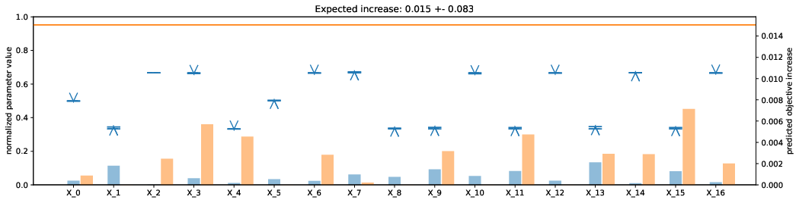
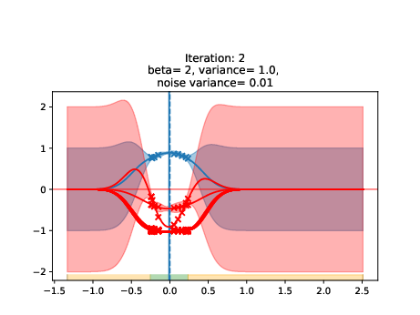
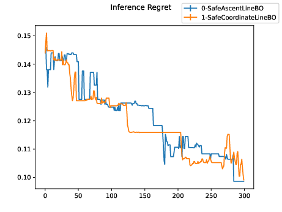
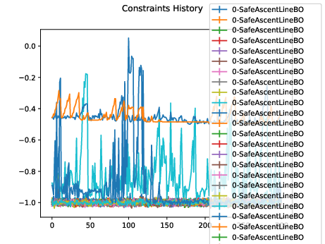

# LineBOforNishinaExperiment


The repository is based on https://github.com/kirschnj/LineBO of the ICML 2019 Paper
"Adaptive and Safe Bayesian Optimization in High Dimensions via One-Dimensional Subspaces", but modified specifically with the aim to apply for the accelerator systems at Nishina Center.

The above paper can be found here: https://arxiv.org/abs/1902.03229

The code can be excecuted by the following procedure

1. Install a Python 3.7 environment
* conda create -n py37 python=3.7
* conda activate py37
2. Install the package with "pip install -e ."
3. pip install git+https://github.com/automl/HPOlib1.5
4. pip install git+https://github.com/befelix/SafeOpt.git
5. pip install importlib-metadata==4.13.0

In case for newly set python3.7 environment, following error occurs
"AttributeError: 'EntryPoints' object has no attribute 'get'C"
Try installing older version of importlib-metadata
pip install importlib-metadata==4.13.0

If the system require numpy version greater than 1.20.0. specify `pip install numpy==1.20.0`.

To run the canonical problems, replace "{experiment_name}" in the instructions below by any of:

* ~~camelback~~
* ~~camelback_sub10~~
* ~~hartmann6~~
* ~~hartmann6_sub14~~
* ~~gaussian10~~
* camelback_constraint
* hartmann6_constraint
* camelback_sub10_constraint

<span style="color: red; ">  Note: currently only ones with constraints available due to the addition of multiple constraints.</span>


Instructions to run experiments and create plots:

1. febo create {user_specified_experiment_name} --config config/{experiment_name}.yaml
2. febo run {user_specified_experiment_name}
                (this will take a while, you can set the number of repetitions in the yaml file)
3. febo plot {user_specified_experiment_name} --plots febo.plots.InferenceRegret

where use your own choice of name for {user_specified_experiment_name}.
Experimental results will be generated under `runs/{user_specified_experiment_name}`. 

***

***

# Interfacing Safe LineBO with Mocadi simulation 


## Quick instruction to run the algorithm on Mocadi

The template YAML file `config/gicosy_interface.yaml` specifies `febo.environment.benchmarks.functions.MocadiSimulation` 
as the benchmark environment to extract objective function. The function interfaces
You can execute Ascent-SafeLineBO and Coordinate-SafeLineBO by the same procedure as before.

```
1. febo create {user_specified_experiment_name} --config config/gicosy_interface.yaml
2. febo run {user_specified_experiment_name}
3. febo plot {user_specified_experiment_name} --plots febo.plots.InferenceRegret
4. febo plot {user_specified_experiment_name} --plots febo.plots.ConstraintsHistory
```

For implementing the interface for Mocadi, 
two major source codes are newly introduced to wrap the mocadi simulation under `gicosy/` directory.

* gicosy/simulation_wrapper.py 
* gicosy/ElectroMagnetClass.py 

Mocadi simulation code is located under
* gicosy/T_Course_Transmission


## Template System description

The default system for trying out LineBO is the BigRIPS beam line, composed of Quadrupole inputs $X \in \mathbb{R}^{17}$, and transmission ratio 
$y=(\mathrm {Transmitted\ particles })/(\mathrm{Total \ particles})$, and 30+1 constraints (30 read from the output table, and one as the lower bound of the transmisstion ratio).
These values are computed or just fetched from the ouput result of Mocadi. 

```shell
$ cat gicosy/T_Cource_Transmission/MonteCarlo_Result__environment.txt
Dipole#0  in:     0,     0,     0,     0,     0
Dipole#0 out:     1,     1,     7,     2,    11
Dipole#1  in:     0,     0,     0,     0,     0
Dipole#1 out:     0,     0,     0,     0,     0
Dipole#2  in:     0,     0,     0,     0,     0
Dipole#2 out:     0,     0,     0,     0,     0
3.707068, 0.451586, 3.474535, 0.383571, 0.034785,  3.595134, 5.482656, 10000, 8219
```
The number of lost particles at each monitor is exported in $5\times6$ matrix, where each column counts the loss at left, right, up and down position.
The last line represents for the properties of the beam distribution;
σx_in, σa_in, σy_in, σb_in, σδ, σx_fp, σy_fp, the number of total particles and the number of transmitted particles. 


## Objective Function


The implementation of this class is under `febo/environment/benchmarks/functions.py`, 

```python
# febo/environment/benchmarks/functions.py

class MocadiSimulation(BenchmarkEnvironment):
    """
    Mocadi simulation interface.
    """
    def __init__(self, path=None):
        super().__init__(path)
        # self.config.dimension = 17 wrote in ymal
        ones = np.ones(self.config.dimension)
        self._domain = ContinuousDomain(-ones, ones)

        # determine x0 based on the initial value of BQ 
        self.emconfig = ElectroMagnetClass() 
        self._x0 = self.emconfig.getX0().flatten() # relative to the domain range
        self._x = self._x0
        self._max_value = 1.0
        # specify to the path where simulation located
        self.mocadi = MocadiInterface('__environment', 'gicosy/T_Cource_Transmission/', self.emconfig) # base is the repository's home directory

    def f(self, X):
        X = np.atleast_2d(X)
        self.mocadi.RunMocadi(X)
        Y = self.mocadi.LoadMocadiResults() # Y \in [0,1]
        return Y
```

which reads out the numerical evaluation of the system via Mocadi simulation wrapper class under `gicosy/simulation_wrapper.py`.
The function `f(self, X)` is to be ***maximized*** in thie context, which is the transmission ratio of the beamline.


In this class, initial state values `BQ0` specified in YAML file is normalized to be casted on $x_i \in [-1,1] \ (i \in R)$, through the class under `gicosy/ElectroMagnetClass.py`. 
The maximum and minimum values can be specified in YAML input deck in 3 ways by changing BQSETMODE configuration. 
The corresponding part in `config/gicosy_interface.yaml` are as follows. 


```yaml 
#config/gicosy_intarface.yaml

environment.benchmark:
  dimension: 17 # decides the dimension of the input

emsetup:
  BQ0: [0.000, -0.313, 0.206, 0.195, -0.207, 0.000, 0.195, 0.198, -0.190, -0.287, 0.332, -0.695, 0.622, -0.026, 0.537, -0.626, 0.906]
  BQSETMODE: hardcode # swtich between "multiplication", "hardcode", and "scalar"
  # multiplication mode
  multiple_factor: 1.5 
  # hardcode mode initial BQ value
  BQ_max: [0.100, -0.313, 0.206, 0.195, -0.207, 0.000, 0.195, 0.198, -0.190, -0.287, 0.332, -0.695, 0.622, -0.026, 0.537, -0.626, 0.906]
  BQ_min: [-0.100, -0.313, 0.206, 0.195, -0.207, 0.000, 0.195, 0.198, -0.190, -0.287, 0.332, -0.695, 0.622, -0.026, 0.537, -0.626, 0.906]
  # add and subtract scalar
  em_scalar: 1.0
```

You can switch how to determine upper and lower bound by switching `BQSETMODE` flag.
1. `multiplication`: The upper or lower bound of input is determined by the multiplied by `multiple_factor` option.  
2. `hardcode`: The maximum and minimum value possible for $X$ is bound by the specified value by `BQ_max` and `BQ_min`.
3. `scalar`: The upper and lower bound is determiend by simply adding and subtracting a single scalar value from the initial input value `BQ0`. 

While specifying one of the above options, specifications from the other options will be ignored.


## Constraints of the beam loss monitors 
Addition of the constraints $g_i(x)\leq 0$ must be manually **hardcoded** depending on the sytem in consideration.
Functions to be loaded for the constraints are specified in YAML file
```yaml
# config/gicosy_interface.yaml

environment.benchmark:
  constraints:
  - gicosy.simulation_wrapper.MocadiConstraint1
  - gicosy.simulation_wrapper.MocadiConstraint2
  - gicosy.simulation_wrapper.MocadiConstraint3
                     ︙                
  - gicosy.simulation_wrapper.MocadiConstraint30
# threshold for the number of particles hitting loss monitor in ratio 
simulation_wrapper:
  ratio_constraints: 0.02
```

Each constraint function is defined under `simulation_wrapper.py`,
where the constraint defined to keep the number of particles hitting the loss monitor below (`ratio_constraints`) $\times$ (`Total num of particles`).

For the future experimental implementation, these constraints ($g_i(X) \leq 0$) must be hardcoded according to the system in its implementation.

## A constraint as the lower bound of the objective function
While maximization of the objective $f(X)$ is pursued, it is often efficient to limit the parameter search space above certain objective value $f(X) \geq \tau$, 
where $f(X_0) \geq \tau$ must be satisified to begin the optimization from the safe set.
This condition can be interpretted as an additional constraint $g(X) = \tau - f(X) \leq 0$.

In its implementation, $\tau$ is specified by `lower_bound_objective` under `environment.benchmark`. 
```yaml
# config/gicosy_interface.yaml
environment.benchmark:
  lower_bound_objective: 0.4 # corresponds to tau
```

***
# Example Output

One sample ouput is prepared under `runs/gicosy_develop_example`.

## Example of LineBO with multiple constraints output

The following figure will be automatically generated under 












# Editor information 
This documentation and extensions are prepared by 
H. Fujii, 
 *Beam Dynamics and diagnostics team led by N. Fukunisi at Riken Nishina Center.*

Also affiliated with *Dynamics & Control Laboratory led by M. Yamakita at Tokyo Tech.*


 Email: fujii $at$ ac.ctrl.titech.ac.jp / hirokifujii9 $at$ gmail.com


 Root and Mocadi environment prepared by T. Nishi, Beam Dynamics and diagnostis at Riken Nishina Center.
